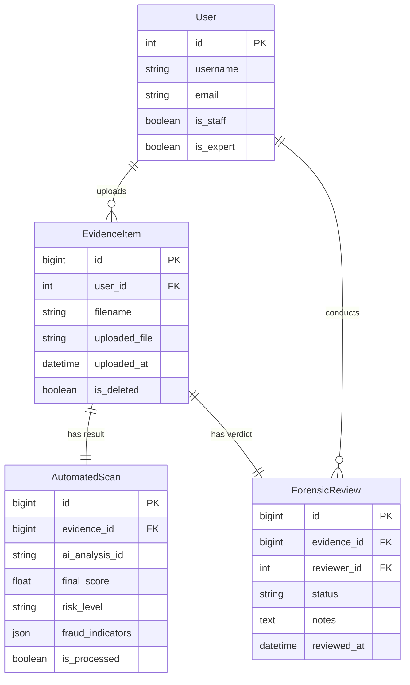
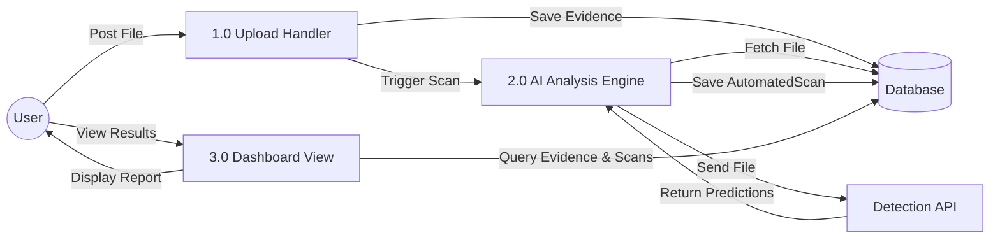
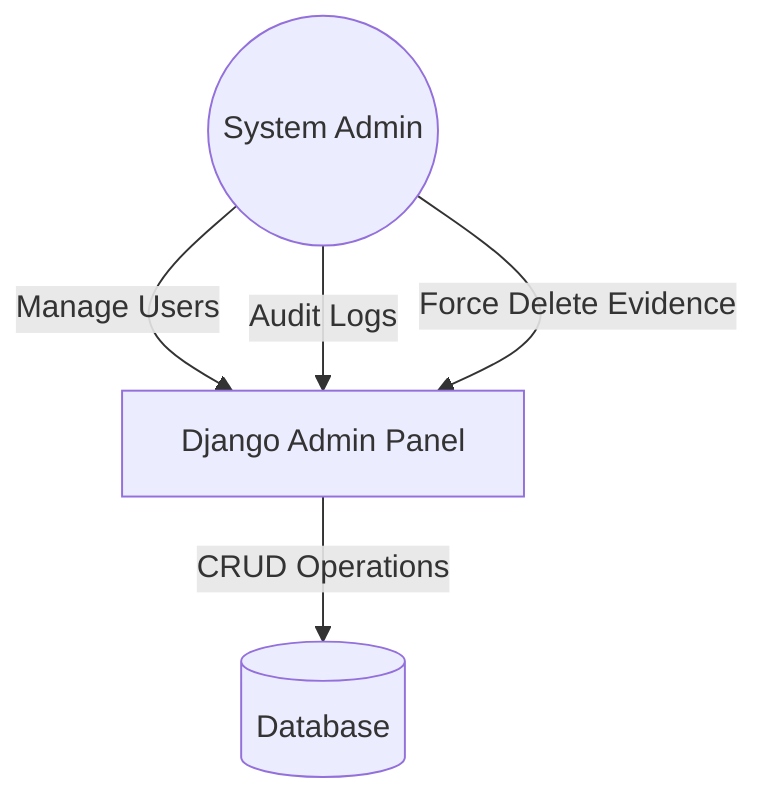

# System Design Documentation

## 1. Entity Relationship Diagram (ERD)

The following diagram illustrates the relationship between the core entities in the Fraud Detection System.



## 2. Data Flow Diagrams (DFD)

### Level 0: Context Diagram

This overview shows the high-level interaction between the User, the System (SentryAI), the Forensic Expert, the System Admin, and the External AI Service.

```mermaid
graph TD
    User[User / Officer] -->|1. Uploads Document| System(SentryAI System)
    System -->|2. Returns Risk Score & Indicators| User
    
    System -->|3. Flags High Risk Cases| Expert[Forensic Expert]
    Expert -->|4. Reviews Evidence| System
    Expert -->|5. Submits Verdict (Reject/Verify)| System
    
    Admin[System Admin] -->|9. User Management & Config| System
    System -->|10. Audit Logs & Reports| Admin

    System -->|6. Updates Case Status| User

    System -->|7. Sends Document for Analysis| API[External Detection API]
    API -->|8. Returns Analysis Results| System
```

### Level 1: User Workflow

Detailed flow of how a standard user works with the system.



### Level 1: Forensic Expert Workflow

Detailed flow of how an expert reviews and adjudicates cases.

```mermaid
graph LR
    Expert((Expert))
    ProcessQueue[4.0 Review Queue]
    ProcessReview[5.0 Review Action]
    DB[(Database)]

    ProcessQueue -->|Query Pending Reviews| DB
    DB -->|List of Cases| Expert
    
    Expert -->|Select Case| ProcessReview
    ProcessReview -->|Fetch Full Evidence| DB
    
    Expert -->|Submit Verdict (Approve/Reject) + Notes| ProcessReview
    ProcessReview -->|Update ForensicReview| DB
    
    ProcessReview -->|Notify System| DB
```

### Level 1: System Administration

Backend management flow.


